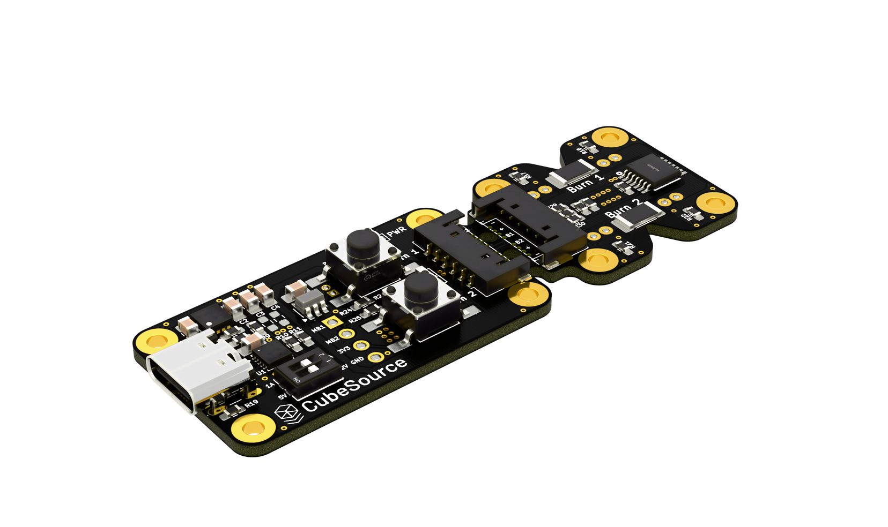
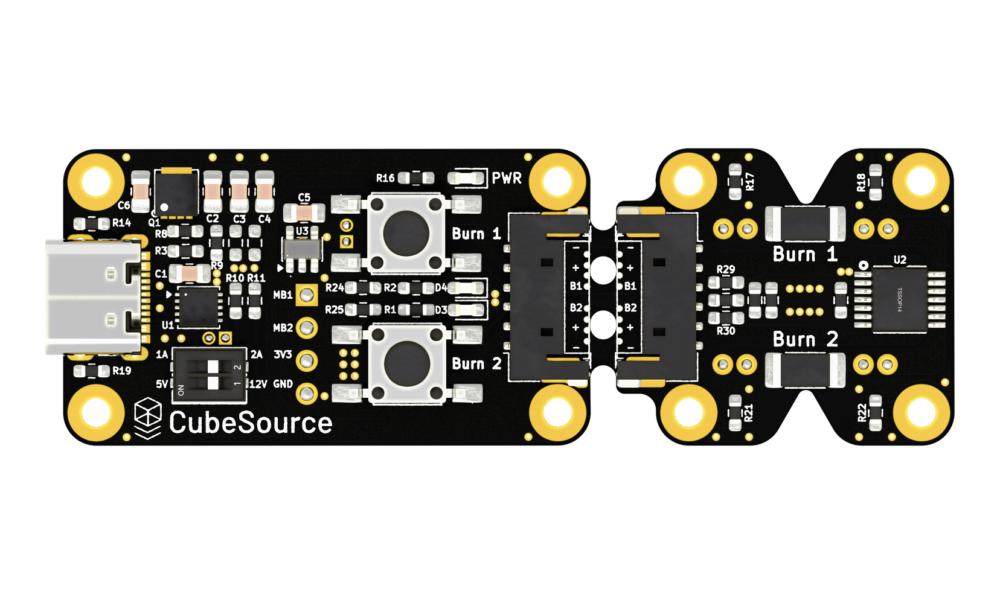
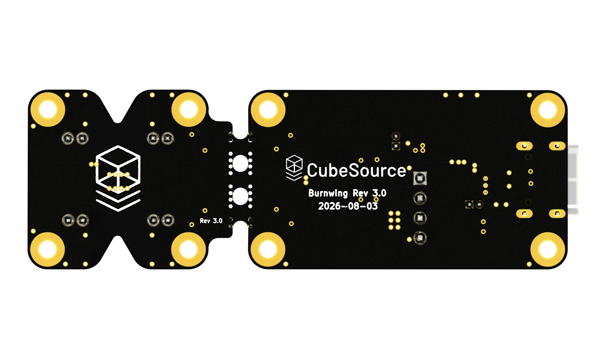

# Burnwing
A dual-purpose engineering/flight model designed to assist in the development of thermal knife release mechanisms and testing of satellite deployables.

## Features
* The dev kit (engineering model) portion includes mouse bites, allowing it to be fully separated from the flight model.
* USB C PD Powered with selectable current and voltage limits for easy testing. Default 5V, 1A
* Integrated ESD, Over Temperature, Over Current and Reverse Polarity Protection.

## Renders

### Isometric

### Top

### Bottom

## Additional Resources

* https://www.cubesource.space/resources
* https://docs.google.com/spreadsheets/d/1-gqduE5_rplaJSyHokB8z7FWwOto8bMK/edit?usp=drive_link&ouid=104061366178972938101&rtpof=true&sd=true
