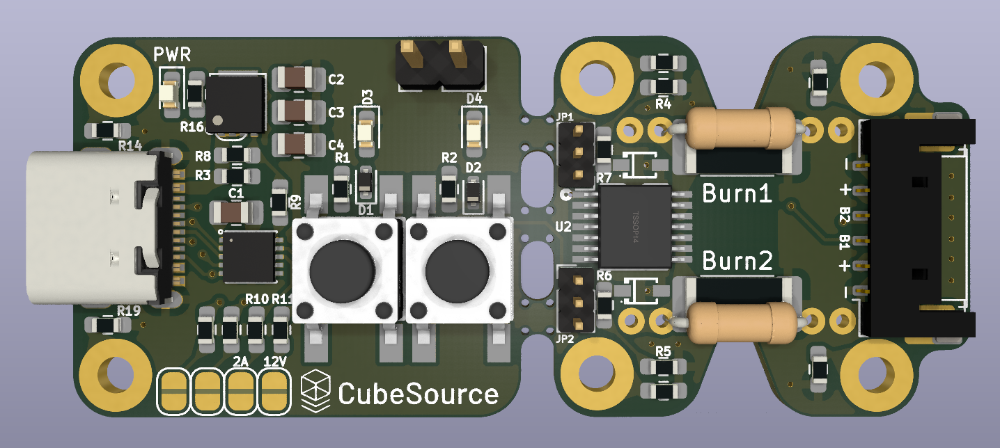

# Burnwing

Burnwing is a burnwire development PCB.

## Features

* Dual-purpose engineering model/flight model to assist in the development of thermal knife release mechanisms and testing of deployables.
    * Optionally, snap off the dev kit portion.
* Powered by USB C with selectable current and voltage limits for easy testing or by picoblade/picolock connectors.
* Default 5V, 1A 

## Renders

## Additional Resources

* https://www.cubesource.space/resources
* https://docs.google.com/spreadsheets/d/1-gqduE5_rplaJSyHokB8z7FWwOto8bMK/edit?usp=drive_link&ouid=104061366178972938101&rtpof=true&sd=true
